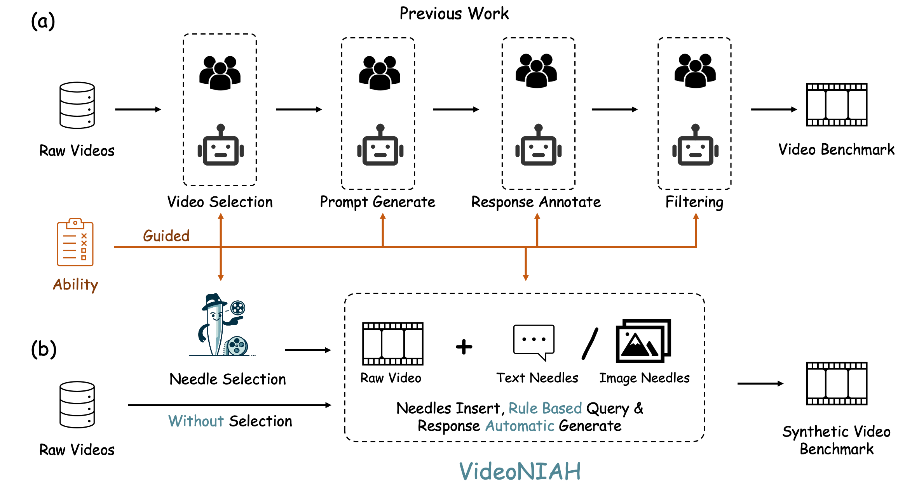

# Needle In A Video Haystack: A Scalable  Synthetic Framework for Benchmarking Video MLLMs (VideoNIAH)

 
 
  
 
 


<p align="center">
    
</p>


<font size=3><div align='center' > [[🍎 Project Page](https://videoniah.github.io/)] [[📖 arXiv Paper](https://arxiv.org/abs/2406.09367)] [[📊 Dataset](https://huggingface.co/datasets/Joez1717/VNBench)]  </div></font>

---

## 🔥 News
* **`2024.06.13`** 🌟 We are very proud to launch VideoNIAH, a scalable synthetic method for benchmarking video MLLMs, and VNBench, a comprehensive video synthetic benchmark!
* **`2025.03.07`** 🌟 VideoNIAH has been accepted as a poster presentation at ICLR 2025.


## 👀 Overview

We propose **VideoNIAH (Video Needle In A Haystack)**, a benchmark construction framework through synthetic video generation. 
**VideoNIAH** decouples test video content from their query-responses by inserting unrelated image/text 'needles' into original videos. It generates annotations solely from these needles, ensuring diversity in video sources and a variety of query-responses.
Additionally, by inserting multiple needles, **VideoNIAH** rigorously evaluates the temporal understanding capabilities of models.
<p align="center">
    
</p>

We utilize VideoNIAH to compile a video benchmark **VNBench**, including tasks such as **retrieval**, **ordering**, and **counting**. **VNBench** contains 1350 samples in total.
**VNBench** can efficiently evaluate the fine-grained understanding ability and spatio-temporal modeling ability of a video model, while also supporting the long-context evaluation. 

<p align="center">
    
</p>

**VideoNIAH** is a **simple** yet highly **scalable** benchmark construction framework, and we believe it will inspire future video benchmark works!


## 🔍 Dataset
Download the raw videos in VNBench from the [google drive link](https://drive.google.com/file/d/1KOUzy07viQzpmpcBqydUA043VQZ4nmRv/view?usp=sharing).
Download the annotation of VNBench from the [huggingface link](https://huggingface.co/datasets/Joez1717/VNBench/tree/main)
**License**:
```
VNBench is only used for academic research. Commercial use in any form is prohibited.
The copyright of all videos belongs to the video owners.
```


## 🔮 Evaluation Pipeline
**Prompt**:

The common prompt used in our evaluation follows this format:

```
<QUESTION>
A. <OPTION1>
B. <OPTION2>
C. <OPTION3>
D. <OPTION4>
Answer with the option's letter from the given choices directly.
```


**Evaluation**: 

We recommend you to save the inference result in the format as [example_result.jsonl](./evaluation/example_result.jsonl). Once you have prepared the model responses in this format, please execute our evaluation script [eval.py](./evaluation/eval_your_results.py), and you will get the accuracy scores. 


```bash
python eval.py \
    --path $RESULTS_FILE
```

If you want to use GPT-3.5 for evaluation, please use the script wo provided [gpt_judge.py](./evaluation/gpt_judge.py).
```bash
python gpt_judge.py \
    --input_file $INPUT_FILE \
    --output_file $OUTPUT_FILE 
```

For convenience, we provide [evaluation code examples](./llava_examples) for the [llavanext](https://github.com/LLaVA-VL/LLaVA-NeXT) series models.

## 📈 Experimental Results
- **Evaluation results of different Video MLLMs.**
Please visit the [leaderboard](https://videoniah.github.io/) for more details.


## Citation

If you find our work helpful for your research, please consider citing our work.   

```bibtex
@article{zhao2024videoniah,
  title={Needle In A Video Haystack: A Scalable  Synthetic Framework for Benchmarking Video MLLMs},
  author={Zhao, Zijia and Lu, Haoyu and Huo, Yuqi and Du, Yifan and Yue, Tongtian and Guo, Longteng and Wang, Bingning and Chen, Weipeng and Liu, Jing},
  journal={arXiv preprint},
  year={2024}
}
```
